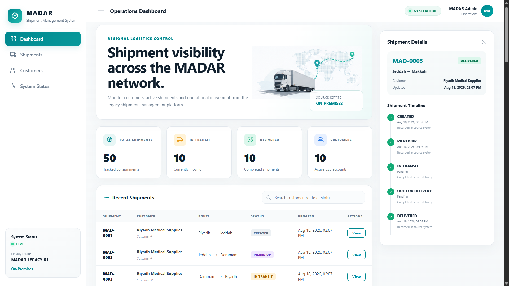
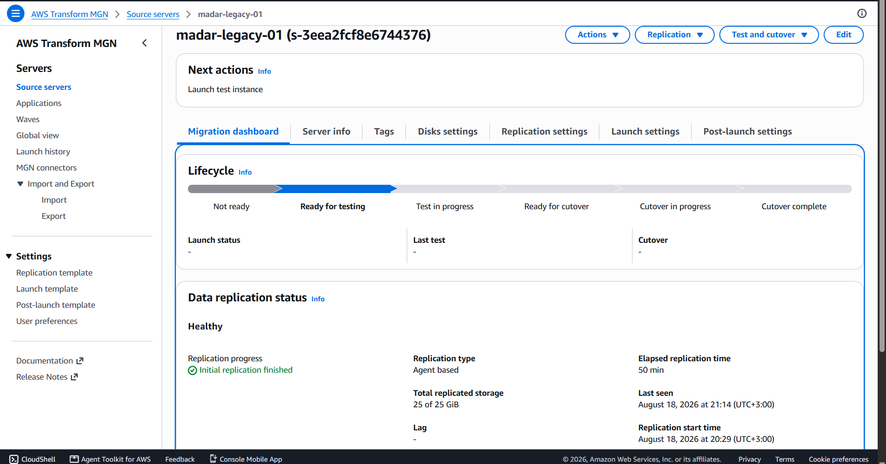
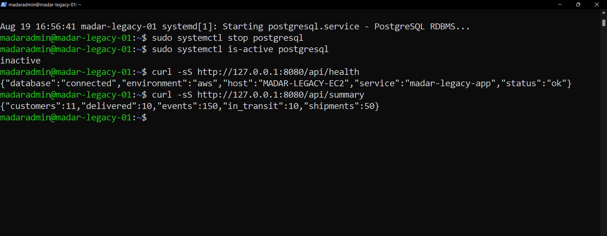

# MADAR — Legacy Migration & Data Center Exit

## Phase 03 of the MADAR Cloud Transformation

> **Status: COMPLETE — migration accepted, validated and cleaned up.**  
> VMware rehost → EC2 → PostgreSQL replatform to RDS → operational files to S3 → application cutover → dependency proof → cleanup.

MADAR is a hands-on, evidence-driven AWS migration case study built around a fictional logistics company and a real lab implementation.

> **Timeline clarification:** the MADAR transformation story begins with a legacy estate **before Phase 01**. The VMware workload in this repository is the reproducible lab representation of that pre-existing estate. It was constructed and baselined as part of preparing the Phase 03 migration exercise, but Phase 03 does not claim that the business legacy system itself originated during this phase.

> **MADAR is fictional.** The workload, Linux configuration, PostgreSQL data, AWS resources, commands, failures, troubleshooting decisions, screenshots and validation steps are authentic lab work.

---

## Executive outcome

```text
Pre-cloud source baseline / recovery point                         PASS
AWS MGN experiment                               BLOCKED / ROOT-CAUSED
VMware -> EC2 with VM Import/Export                              PASS
EC2 PostgreSQL -> RDS with AWS DMS Full Load + CDC               PASS
Operational files -> Amazon S3                                   PASS
S3 object-count + SHA-256 round-trip validation                  PASS
Flask application -> RDS cutover                                 PASS
Local PostgreSQL disabled while application stayed healthy       PASS
Temporary migration infrastructure cleanup                       PASS
```

The project deliberately preserves failed paths. MGN and DMS endpoint failures are documented because production migration work is as much about isolating the failing layer as it is about reaching the happy path.

---

# 1 — Business problem

MADAR's scenario includes an inherited shipment-management workload in a traditional VMware-style estate. Phase 03 takes that source as its starting point and executes a controlled data-center-exit exercise without combining every risk into one big-bang rewrite.

The representative lab consolidates the relevant source responsibilities into one VMware VM because the physical lab host is constrained. This is a migration test topology, not a claim about the exact topology of a real production data center.

The migration was decomposed by component:

```text
Pre-existing Legacy Baseline
        |
        +-- Ubuntu + Flask ------ REHOST ------> Amazon EC2
        |
        +-- PostgreSQL ---------- REPLATFORM --> Amazon RDS
        |
        +-- Operational files --- REPLATFORM --> Amazon S3
```

This staged model behaves like moving a company office one department at a time: first prove the server can survive the building move, then move the database, then move file storage, and only then switch the application dependency.

---

# 2 — Representative source workload

```text
MADAR-LEGACY-01
├── VMware virtual machine
├── Ubuntu Server 24.04.4 LTS
├── PostgreSQL 16.14
├── Flask application / TCP 8080
├── 25 GiB GPT + LVM/ext4 disk
├── scheduled operational reports
└── deterministic business baseline
    ├── customers = 10
    ├── shipments = 50
    └── shipment_events = 150
```



The deterministic dataset made validation measurable: `EC2 running` was never treated as proof that the business workload survived.

The source-lab build documentation is retained so another engineer can reproduce the migration source. It should be read as **lab construction of the baseline representation**, not as Phase 03 creating MADAR's historical legacy estate.

---

# 3 — Migration strategy and the MGN pivot

AWS Application Migration Service (MGN) was tested first. Source discovery and block replication reached `25/25 GiB`, `Healthy`, and `Ready for testing`.



The test conversion later failed. CloudTrail showed the failing resource was not the configured target `t3.small`; it was a service-managed MGN Conversion Server requesting `m5.large`, which the lab account plan did not allow.

```text
visible target instance      t3.small
service-managed conversion   m5.large
failing layer                conversion service
```

The project did not hide the failure or upgrade the account merely to make the demo pass. The strategy pivoted to EC2 VM Import/Export. See [`ADR-002`](decisions/ADR-002-mgn-free-plan-blocker-and-vm-import-fallback.md).

---

# 4 — VMware -> EC2 with VM Import/Export

The guest was prepared for AWS virtual hardware before export:

```text
ENA networking
NVMe block devices
GRUB / BIOS boot
LVM + ext4
eth0 + DHCP
SSH/PostgreSQL reboot readiness
```

The installer ISO was removed from the VMware export and the final VMDK was confirmed `streamOptimized`.

```text
VMware
  -> clean VMDK
  -> private S3 staging
  -> EC2 ImportImage
  -> EBS-backed AMI
  -> EC2 launch
```

The imported workload was validated at the OS, network, storage, database and application layers before database migration continued.

---

# 5 — PostgreSQL -> Amazon RDS with AWS DMS

The accepted database path replatformed PostgreSQL 16.14 to private Amazon RDS PostgreSQL 16.14 using AWS DMS.

```text
Full Load baseline
customers         10
shipments         50
shipment_events   150
Tables errored    0

CDC proof
source customer #11 -> RDS customer #11

Final reconciliation
customers         11
shipments         50
shipment_events   150
```

Source and target endpoint failures were diagnosed rather than bypassed: network reachability, PostgreSQL permissions, credentials and TLS were isolated independently.

---

# 6 — Operational files -> Amazon S3

Operational exports, reports, logs and manifests were synchronized to the retained operational bucket.

Validation did not stop at a successful `aws s3 sync` message:

```text
Source files       14
S3 objects         14
Downloaded copy    14
SHA-256 comparison ALL FILE HASHES MATCH
```

This provided both count reconciliation and content-integrity proof after round-trip download.

---

# 7 — Application cutover and dependency proof

The Flask application originally used a local PostgreSQL dependency. Its database configuration was changed to environment-driven values supporting the RDS host, database, application role, password and SSL mode.

After RDS cutover, application health and summary data were verified. Then the decisive test was executed: **local PostgreSQL was stopped**.

```text
local postgresql.service  inactive
Flask /api/health         database=connected / status=ok
Flask /api/summary        11 customers / 50 shipments / 150 events
```

The application therefore continued serving database-backed responses without the local database process, proving that the runtime dependency had actually moved to RDS.



---

# 8 — Cleanup

After acceptance, temporary migration infrastructure was intentionally removed:

```text
EC2 instance                     terminated
attached temporary EBS volume    deleted
RDS target                        deleted after evidence capture
DMS task/endpoints/instance       deleted
DMS/RDS subnet groups             deleted
migration security groups         deleted
VM-import staging VMDK/bucket     deleted
temporary EC2 S3 role/profile     deleted
NAT gateways                      none
Elastic IPs                       none
Load balancers                    none
```

The final account audit showed no active EC2, RDS, DMS, standalone EBS, NAT Gateway, Elastic IP or load-balancer resources from the lab.

Intentionally retained:

```text
Imported AMI     ami-0cbd2e9ec0d6f9168
Backing snapshot snap-0920a020c47fb6447
Operational S3   madar-operational-files-197821101770
```

The snapshot and S3 storage can still incur storage charges; they are retained deliberately rather than forgotten compute infrastructure.

---

# 9 — Evidence story

A reviewer can follow the migration visually through:

1. source VMware workload and baseline evidence,
2. MGN replication and root-cause evidence,
3. VM Import/Export and EC2 acceptance,
4. DMS Full Load / CDC / reconciliation,
5. pre-cutover application state,
6. AWS/RDS application state,
7. local PostgreSQL shutdown proof,
8. final AWS cleanup audit.

See [`evidence/README.md`](evidence/README.md) and [`evidence/screenshots/README.md`](evidence/screenshots/README.md).

---

# 10 — Engineering decisions demonstrated

- Treat the source estate as a dependency graph, not merely a VM.
- Separate the business scenario chronology from lab construction chronology.
- Select migration disposition per component.
- Preserve failed approaches and root-cause evidence.
- Validate business state independently of infrastructure state.
- Require CDC/reconciliation before database acceptance.
- Require object count and content integrity for file migration.
- Prove dependency removal by disabling the old dependency.
- Clean up temporary infrastructure after evidence is captured.
- Retain only artifacts with an explicit recovery/data purpose.

---

# 11 — Repository map

```text
legacy-lab/      reproducible representative source workload

docs/            business case, source estate, discovery, strategy,
                 architecture, validation and execution guides

decisions/       migration ADRs and pivots

runbooks/         migration-day execution and rollback guidance

checklists/       acceptance and closeout gates

evidence/         screenshots and validation evidence

CURRENT-STATE.md  final accepted state
```

The transformation-level company story lives in [`MADAR-cloud-transformation`](https://github.com/EngMohammedBashir/MADAR-cloud-transformation).

---

# 12 — Final result

Phase 03 is **COMPLETE / ACCEPTED / CLEANED UP**.

The lab demonstrated an end-to-end migration narrative from a simulated pre-existing VMware legacy baseline to AWS: VM rehost, database replatform, operational-file migration, application cutover, dependency-removal proof and intentional cleanup.

The project does not claim that MADAR is a real company or that the lab topology is a literal production data center. It demonstrates the engineering decisions, failure analysis and validation discipline expected in a realistic migration engagement.
