# MADAR — Legacy Migration & Data Center Exit

## Phase 03 of the MADAR Cloud Transformation

This repository is a hands-on, evidence-driven AWS migration case study. It starts with a working VMware-hosted legacy logistics application, discovers and protects the source, attempts AWS MGN, diagnoses a managed-service blocker, pivots to EC2 VM Import/Export, validates the imported workload on EC2, and then replatforms PostgreSQL to Amazon RDS with AWS DMS **Full Load + CDC**.

> **MADAR is fictional.** The workload, Linux configuration, PostgreSQL data, AWS resources, commands, failures, troubleshooting decisions, screenshots and validation steps are authentic lab work.

---

## Executive outcome

```text
Stage 0 — Build and baseline representative legacy workload        PASS
Stage 1A — AWS MGN experiment                                     BLOCKED / ROOT-CAUSED
Stage 1B — VMware -> EC2 with VM Import/Export                    PASS
Stage 2 — EC2 PostgreSQL -> RDS with AWS DMS Full Load + CDC      PASS
Stage 3 — Operational files -> S3                                 NEXT
Cutover / final cleanup                                            NEXT
```

The project does **not** hide failed paths. The MGN failure and the DMS endpoint failures are documented because the engineering value is in identifying the failing layer and correcting it without weakening security or inventing a success claim.

---

# 1. Business problem

MADAR represents a company that has an operational shipment-management workload running on a VMware-based legacy server. The objective is to leave the data-center-style environment without performing an application rewrite and infrastructure migration at the same time.

The staged strategy is:

```text
Legacy VMware workload
        |
        | Stage 1 — REHOST
        v
Amazon EC2 intermediate landing zone
        |
        | Stage 2 — DATABASE REPLATFORM
        v
Amazon RDS for PostgreSQL
        |
        | Stage 3 — FILE REPLATFORM
        v
Amazon S3
```

The design intentionally separates machine migration from database modernization. If the server rehost fails, the problem is not mixed with an RDS migration. If the DMS migration fails, the EC2 landing workload is already known-good.

---

# 2. Source workload built for the migration

The source VM was deliberately made stateful enough to test a real migration instead of moving an empty Linux server.

```text
MADAR-LEGACY-01
├── VMware virtual machine
├── Ubuntu Server 24.04.4 LTS
├── Kernel 6.8.0-138-generic / x86_64
├── BIOS + GRUB2
├── 2 vCPU / ~2.4 GiB RAM
├── 25 GiB GPT disk
│   ├── BIOS boot partition
│   ├── ext4 /boot
│   └── LVM -> ubuntu-vg/ubuntu-lv -> ext4 /
├── Flask application / TCP 8080
├── PostgreSQL 16.14 / TCP 5432
├── database: madar_legacy
├── scheduled operations report script
└── deterministic business baseline
    ├── customers = 10
    ├── shipments = 50
    └── shipment_events = 150
```

### Source application


The deterministic baseline lets the project distinguish “the machine booted” from “the business data actually survived.”

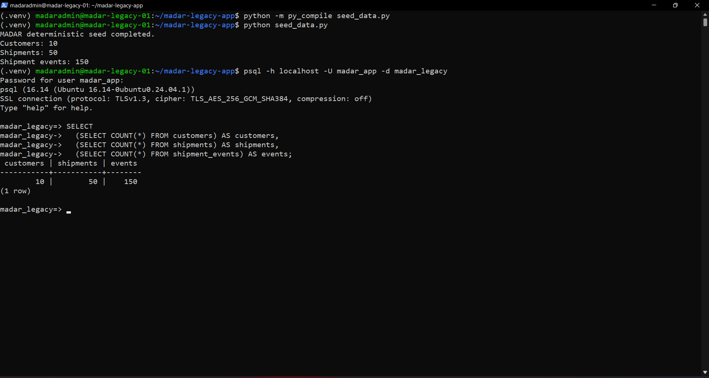

---

# 3. Where the application and code live

The implementation code is not buried inside screenshots.

```text
legacy-lab/
├── README.md
├── app/
│   ├── app.py              # Flask application and API routes
│   ├── schema.sql          # PostgreSQL schema
│   ├── seed_data.py        # deterministic source dataset generator
│   ├── requirements.txt    # Python dependencies
│   ├── templates/          # HTML templates
│   └── static/             # frontend assets
└── scripts/
    └── generate_operations_report.sh
```

Important code paths:

- [`legacy-lab/app/app.py`](legacy-lab/app/app.py) — Flask application, health/summary APIs and database operations.
- [`legacy-lab/app/schema.sql`](legacy-lab/app/schema.sql) — `customers`, `shipments`, and `shipment_events` schema.
- [`legacy-lab/app/seed_data.py`](legacy-lab/app/seed_data.py) — creates the deterministic `10 / 50 / 150` baseline.
- [`legacy-lab/app/requirements.txt`](legacy-lab/app/requirements.txt) — runtime Python requirements.
- [`legacy-lab/scripts/generate_operations_report.sh`](legacy-lab/scripts/generate_operations_report.sh) — representative scheduled operational job.

The important migration commands are documented separately instead of being mixed into application code:

```text
docs/07-vm-import-execution-guide.md   VMware -> S3 -> VM Import -> EC2
docs/09-dms-rds-execution-guide.md     EC2 PostgreSQL -> DMS -> RDS
runbooks/migration-day-runbook.md       ordered migration / rollback / cleanup
```

---

# 4. Source discovery before migration

Before selecting AWS resources, the source was inspected for the things most likely to break during a hypervisor move:

```text
compute
storage / partitions / LVM
boot mode / GRUB
network interface naming
kernel / initramfs drivers
running services
ports
PostgreSQL state
application dependencies
cron/background jobs
files and reports
recovery artifacts
```

Representative discovery commands included:

```bash
uname -a
lsblk -f
sudo fdisk -l /dev/sda
sudo pvs
sudo vgs
sudo lvs
systemctl --failed --no-pager
ss -lntp
```

The source was also backed up at the PostgreSQL application layer using a custom-format dump and validated with `pg_restore -l` before image migration.

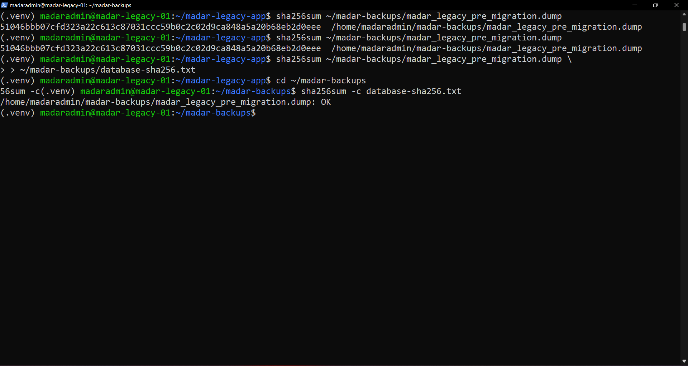

---

# 5. First rehost attempt — AWS MGN

AWS Application Migration Service / AWS Transform was evaluated first because block-level replication is a natural rehost mechanism for a VMware-style server.

The source successfully reached:

```text
25 / 25 GiB replicated
Initial replication finished
Healthy
Ready for testing
```


The visible target launch configuration used `t3.small`, but test launch still failed.

The failure was traced with CloudTrail to a different resource:

```text
Service caller       mgn.amazonaws.com
API                  ec2:RunInstances
Purpose              MGN Conversion Server
IAM profile          AWSApplicationMigrationConversionServerRole
Requested type       m5.large
Result               Client.InvalidParameterCombination
Constraint           instance type not allowed by the account plan
```

This led to an important distinction:

```text
MGN replication server     configurable
MGN final target EC2        configurable
MGN conversion server      service-managed
```

Changing the visible target from one small instance type to another would not fix a service-managed conversion server requesting `m5.large`.

AWS Transform support confirmed the conversion-server sizing was not customer configurable. The lab therefore did **not** upgrade the account just to make the demo pass. MGN resources were cleaned and the rehost mechanism was changed.

See:

- [`decisions/ADR-002-mgn-free-plan-blocker-and-vm-import-fallback.md`](decisions/ADR-002-mgn-free-plan-blocker-and-vm-import-fallback.md)
- [`docs/08-interview-guide.md`](docs/08-interview-guide.md)

---

# 6. Pivot to EC2 VM Import/Export

The fallback kept the same engineering objective: move the existing VMware machine image into AWS rather than rebuilding a fresh Ubuntu server.

```text
VMware VM
   |
   | clean export
   v
streamOptimized VMDK
   |
   | aws s3 cp
   v
private S3 staging bucket
   |
   | EC2 VM Import/Export
   v
EBS-backed AMI
   |
   v
Amazon EC2
```

---

# 7. Guest preparation for EC2 compatibility

A disk image can contain a healthy application and still fail in another hypervisor because early boot cannot see the new NIC or disk.

The guest was prepared before export.

## Boot/storage checks

```bash
sudo grub-install --recheck /dev/sda
sudo update-grub
lsblk -f
sudo pvs
sudo vgs
sudo lvs
```

Observed layout:

```text
25 GiB GPT
├── 1 MiB BIOS boot
├── 2 GiB ext4 /boot
└── ~23 GiB LVM -> ext4 /
```

## AWS virtual-hardware driver readiness

The kernel/initramfs were checked for:

```text
ENA           EC2 networking
NVMe          Nitro-era EBS presentation
xen_blkfront  block-device compatibility
```

## VMware NIC dependency removed

The source originally depended on `ens33`. GRUB and Netplan were changed to use `eth0` with DHCP, then reboot-tested before export.

```text
Before: ens33 / VMware-specific environment
After:  eth0 / DHCP
```

The VMware validation after reboot showed the source working on `eth0`, preserving Internet/DNS access before migration.

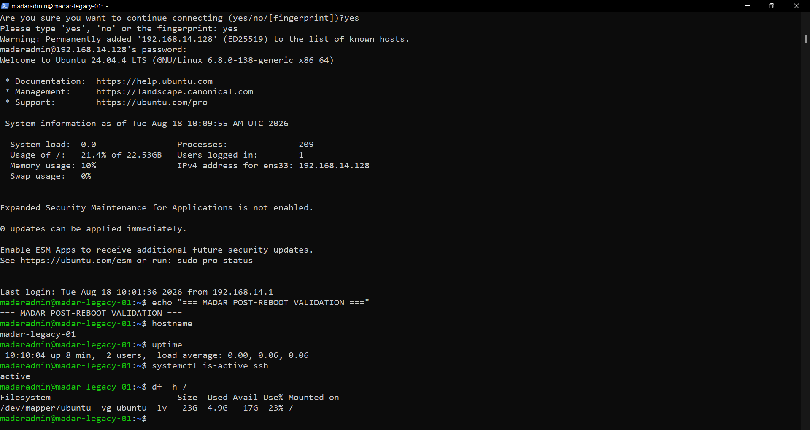

## Boot-time services

SSH and PostgreSQL were checked for both current state and reboot state:

```bash
sudo systemctl enable ssh
systemctl is-enabled ssh
systemctl is-active ssh

systemctl is-enabled postgresql
systemctl is-active postgresql
```

---

# 8. VMware export hygiene

The first OVF export was inspected and rejected because the Ubuntu installer ISO was still attached to the virtual CD/DVD device.

Instead of blindly migrating that artifact:

```text
first export
├── OVF
├── VMDK
└── installer ISO  ❌
```

The CD/DVD device was detached and the export was repeated:

```text
final clean export
├── MADAR-LEGACY-01.ovf
├── MADAR-LEGACY-01.mf
└── MADAR-LEGACY-01-disk1.vmdk
```

The OVF declared the VMDK as `streamOptimized`, suitable for the import workflow.

---

# 9. Private S3 staging

The VMDK lived on the local Windows workstation, so the upload ran from Windows PowerShell rather than CloudShell.

```powershell
aws s3 cp "C:\Users\SCAR\Documents\Virtual Machines\New folder\MADAR-LEGACY-01-disk1.vmdk" `
  "s3://madar-vm-import-197821101770/MADAR-LEGACY-01-disk1.vmdk" `
  --region us-east-1
```

Why Windows?

```text
Windows PowerShell  can read C:\Users\... and upload the VMDK
AWS CloudShell      cannot see the local workstation filesystem
```

The S3 staging bucket was private and Block Public Access was enabled.

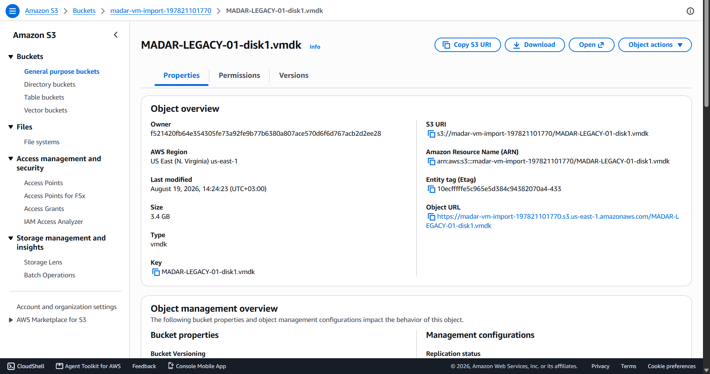

---

# 10. VM Import/Export IAM service role

VM Import/Export needed a service role named `vmimport`.

Mental model:

```text
VM Import/Export service = worker
vmimport role            = permission badge
private S3 bucket        = warehouse
VMDK                     = source package
AMI                      = converted AWS artifact
```

Trust relationship:

```text
Trusted service  vmie.amazonaws.com
External ID      vmimport
```

The role received scoped S3 read permissions and EC2 image/snapshot operations required by the import process.

The operator also verified `iam:PassRole` before launching the slow asynchronous import.

```bash
aws iam simulate-principal-policy \
  --policy-source-arn arn:aws:iam::197821101770:user/mohammed-admin \
  --action-names iam:PassRole \
  --resource-arns arn:aws:iam::197821101770:role/vmimport \
  --query 'EvaluationResults[0].EvalDecision' \
  --output text
```

Observed:

```text
allowed
```

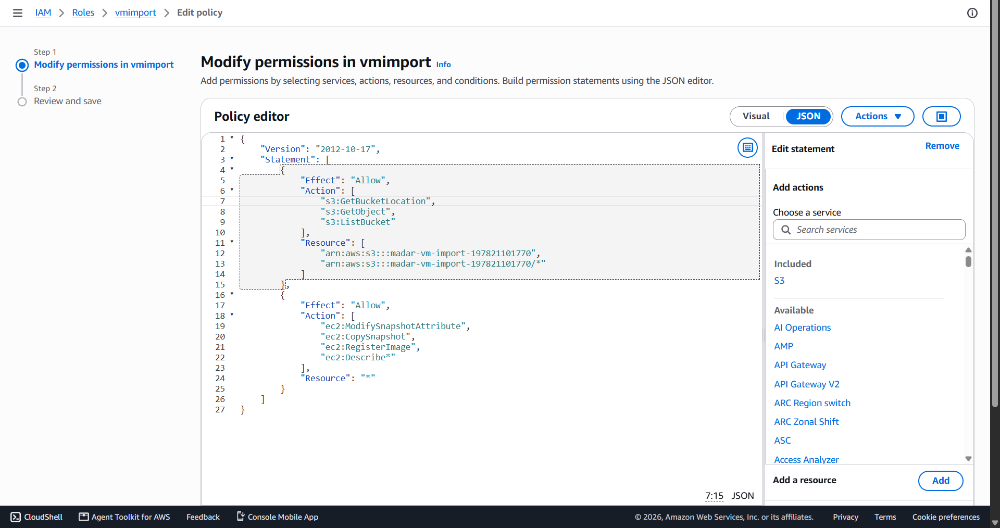

---

# 11. Start and monitor VM Import/Export

The source VMDK was referenced from S3 using `aws ec2 import-image`.

Important task result:

```text
ImportTaskId  import-ami-48f44651b4c75774t
```

The asynchronous task was monitored rather than assumed successful after submission.

Observed progression included:

```text
converting
updating
booting
completed
```

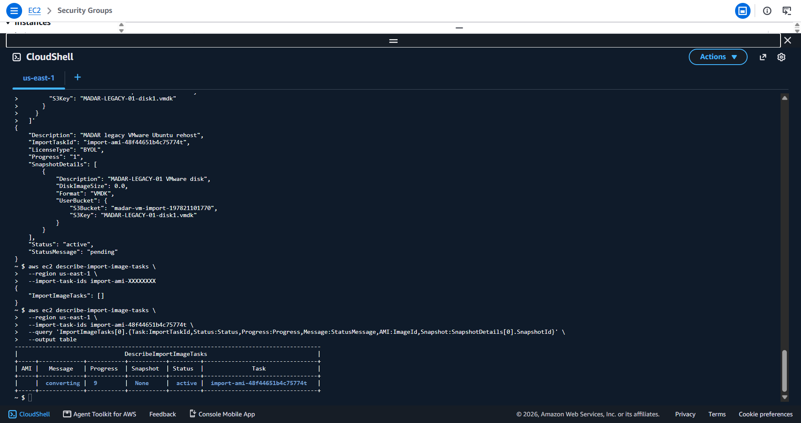

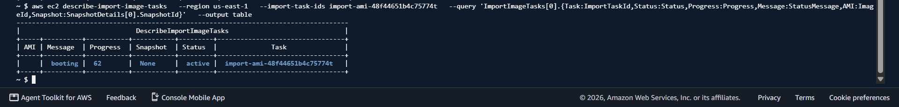

Final result:

```text
Status         completed
AMI            ami-0cbd2e9ec0d6f9168
Snapshot       snap-0920a020c47fb6447
Architecture   x86_64
Virtualization HVM
ENA            enabled
Root volume    25 GiB
```


The AMI itself was then verified as `available`.

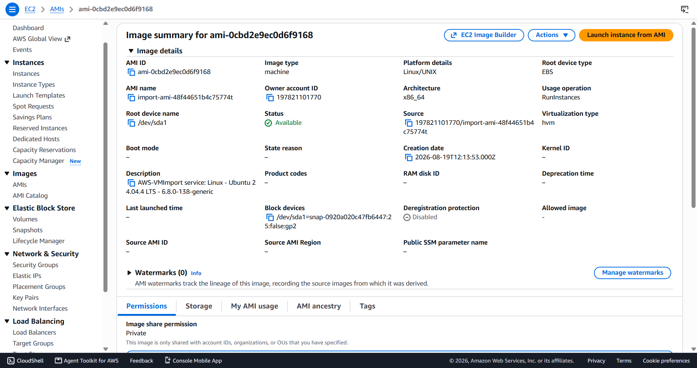

---

# 12. Launch imported AMI on EC2

The AMI was launched as:

```text
Name          MADAR-LEGACY-EC2
Instance ID   i-051336c5f304a5319
Type          t3.small
VPC           vpc-015017581b8954e61
Private IP    172.31.3.142
OS            Linux / Ubuntu
Boot          legacy BIOS
Virtualization HVM
```

SSH ingress was restricted to the operator IP for validation rather than opened globally.

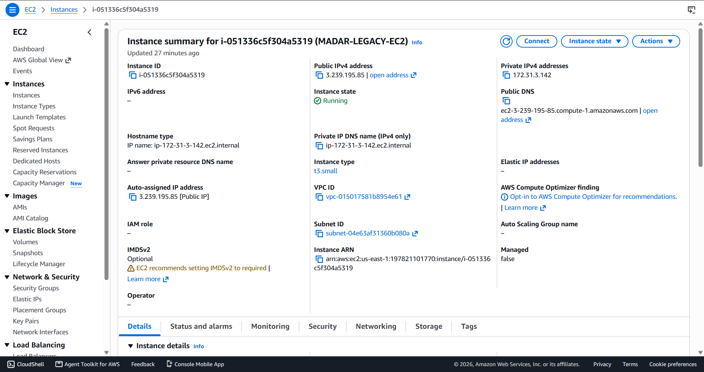

The EC2 status checks passed before application-level validation continued.


---

# 13. Hypervisor-move validation on EC2

This was one of the strongest technical checkpoints.

The same migrated guest that used VMware storage/networking now showed:

```text
Network
VMware: 192.168.14.x
AWS:    172.31.3.142 on eth0

Storage
VMware: /dev/sda
AWS:    /dev/nvme0n1

Filesystem
LVM + ext4 remained mounted and healthy
```

SSH successfully reached the migrated Ubuntu server.

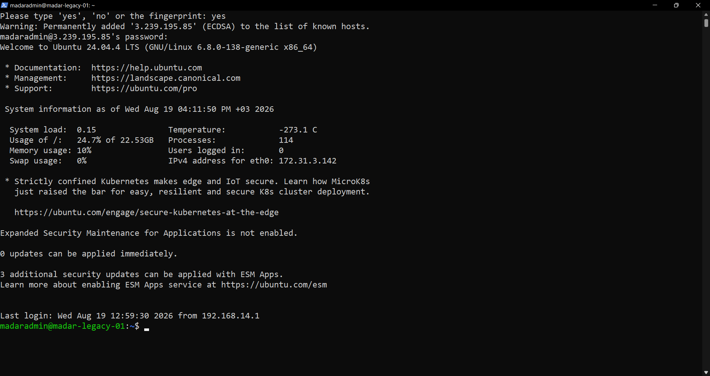

Post-migration workload validation confirmed network, LVM, PostgreSQL and schema presence.

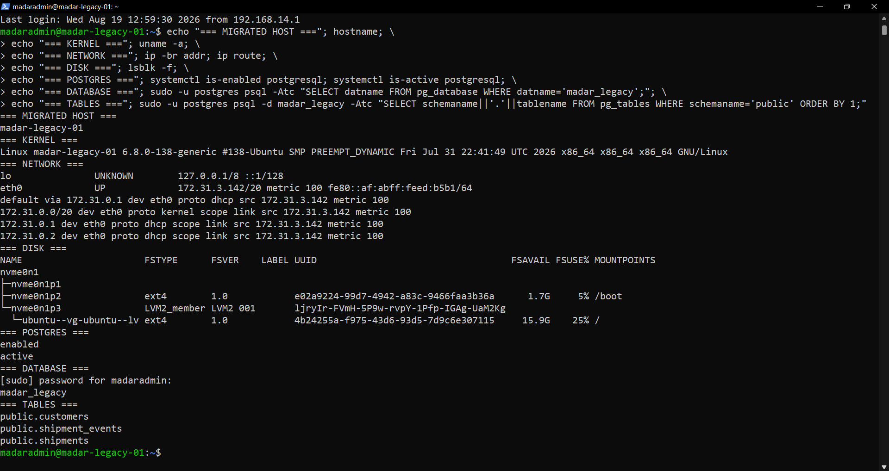

Database reconciliation showed the original deterministic state:

```text
customers        10
shipments        50
shipment_events  150
PostgreSQL       16.14
failed services  0
```

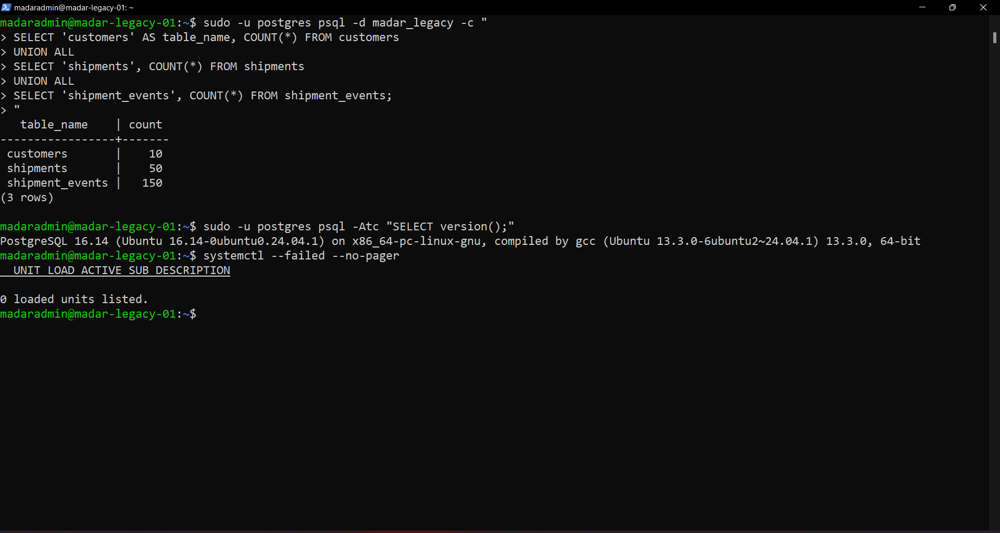

---

# 14. Flask application validation after rehost

The Flask application files and Python virtual environment survived the migration.

One useful migration finding was that Flask did not start automatically after reboot because the legacy server had no dedicated systemd service for the application. That is a real operational dependency discovered by migration validation, not an EC2 failure.

The application was started using the original runtime model and its database credential was loaded into the process environment.

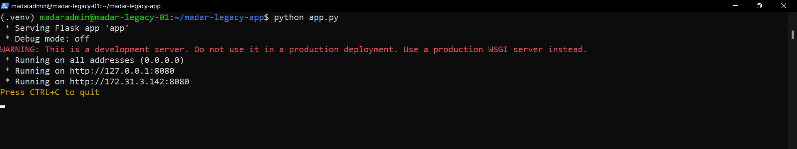

Health and summary APIs then proved application-to-database functionality:

```json
{"database":"connected","service":"madar-legacy-app","status":"ok"}
```

and:

```json
{"customers":10,"shipments":50,"events":150,...}
```


At this point Stage 1 was accepted:

```text
VMware -> S3 -> VM Import/Export -> AMI -> EC2
OS             PASS
network         PASS
storage/LVM     PASS
PostgreSQL      PASS
business data   PASS
Flask API       PASS
```

---

# 15. Stage 2 — Prepare PostgreSQL for DMS CDC

The EC2 database became the source for database modernization.

Initial values:

```text
wal_level              replica
max_replication_slots  10
max_wal_senders        10
```

CDC requires logical change information, so `wal_level` was changed to `logical` and PostgreSQL restarted.

```bash
sudo cp /etc/postgresql/16/main/postgresql.conf \
  /etc/postgresql/16/main/postgresql.conf.pre-dms

sudo sed -i "s/^#*wal_level.*/wal_level = logical/" \
  /etc/postgresql/16/main/postgresql.conf

sudo systemctl restart postgresql
```

Validated state:

```text
logical
10
10
```

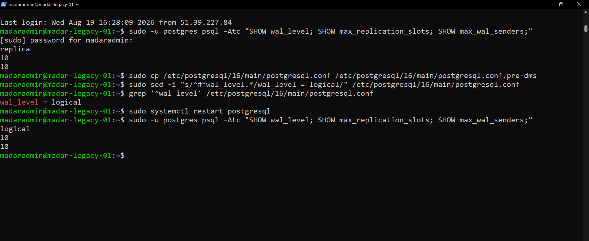

PostgreSQL was also configured to listen for VPC-local connections and `pg_hba.conf` was updated for authenticated VPC traffic.

A dedicated `dms_user` was created for the migration path rather than reusing the Flask application login.

Full command explanation: [`docs/09-dms-rds-execution-guide.md`](docs/09-dms-rds-execution-guide.md).

---

# 16. DMS/RDS network design

Three Security Groups were involved:

```text
EC2 source SG   sg-0589383abcc3ebbbc
DMS SG          sg-085569e2731850c8a
RDS SG          sg-093756a8cabaad407
```

Migration traffic was SG-to-SG:

```text
DMS SG  -- TCP/5432 --> EC2 PostgreSQL source
DMS SG  -- TCP/5432 --> RDS PostgreSQL target
EC2 SG  -- TCP/5432 --> RDS   # later added for validation/cutover testing
```

No `0.0.0.0/0 -> 5432` rule was used.

---

# 17. Create private RDS target

The RDS target intentionally matched the source PostgreSQL release:

```text
Identifier       madar-postgres-target
Engine           PostgreSQL 16.14
Class            db.t3.micro
Storage          20 GiB gp3
Public access    false
Multi-AZ         false for this small lab
Database         madar_legacy
```

The subnet group spans two AZs (`us-east-1a`, `us-east-1b`) even though the lab DB itself is Single-AZ.

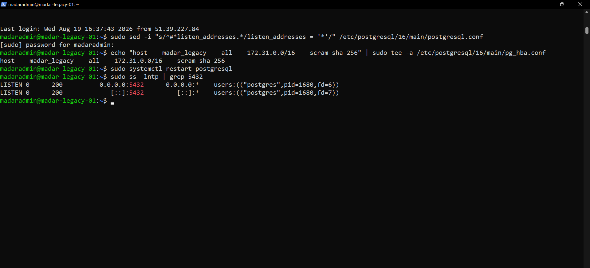

---

# 18. DMS IAM prerequisite failure

The first DMS replication-subnet-group operation failed with:

```text
The IAM Role ...:role/dms-vpc-role is not configured properly
```

This was correctly treated as an IAM prerequisite, not a subnet or Security Group failure.

The role was created/configured with:

```text
Role          dms-vpc-role
Trusted       dms.amazonaws.com
Policy        AmazonDMSVPCManagementRole
```

After fixing the role, the same replication subnet group request succeeded.

That sequence is useful because it demonstrates control-plane troubleshooting:

```text
DMS cannot manage VPC resources
        ↓
check dms-vpc-role
        ↓
fix trust + managed policy
        ↓
retry same network operation
        ↓
success
```

---

# 19. DMS replication instance

The DMS compute node was created as:

```text
Identifier    madar-dms-repl
Class         dms.t3.small
Engine        3.6.1
Storage       20 GiB
Public        false
Private IP    172.31.13.46
```

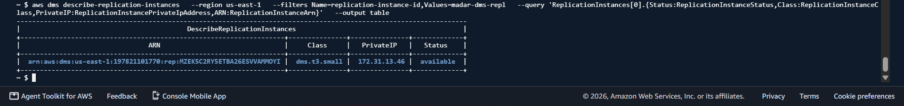

Think of the pieces this way:

```text
Source Endpoint       = old warehouse address
Replication Instance  = transport truck
Target Endpoint       = new warehouse address
```

---

# 20. DMS source endpoint

The source endpoint points to the PostgreSQL server on imported EC2:

```text
Server      172.31.3.142
Port        5432
Database    madar_legacy
User        dedicated DMS migration login
```

The connection test succeeded:

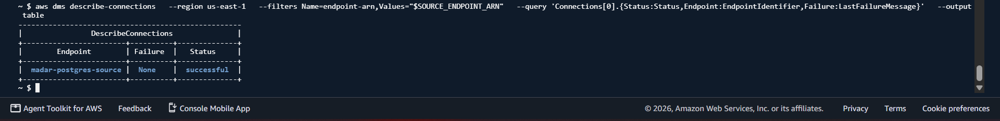

This proved DMS could traverse the VPC path, Security Group and PostgreSQL authentication layers to the EC2 source.

---

# 21. DMS target endpoint — two useful failures

The target endpoint points to private RDS PostgreSQL.

The first test reached RDS but failed with a PostgreSQL message indicating **no encryption**. That was valuable evidence: DNS, routing, SG and TCP/5432 were already working; the target rejected the connection at the database security layer.

The DMS target endpoint was changed to:

```text
SslMode = require
```

The next test reached RDS over SSL but failed with:

```text
password authentication failed for user "postgres"
```

Again, the failing layer was now authentication, not networking.

The RDS master password was reset and the DMS endpoint updated with the same credential without committing the secret to Git.

The final connection test succeeded:

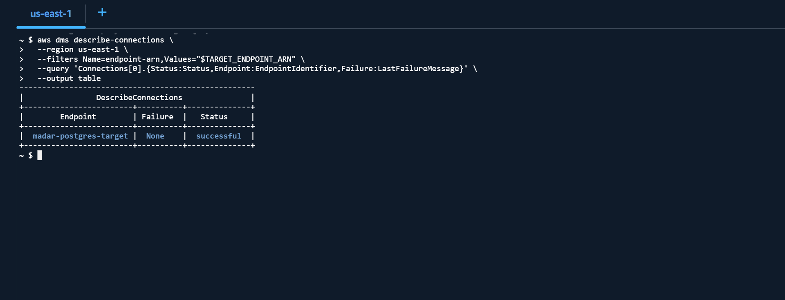

This progression is intentionally documented:

```text
network path             PASS
        ↓
unencrypted connection   REJECTED
        ↓
SSL required             FIXED
        ↓
credential mismatch      REJECTED
        ↓
credential synchronized  FIXED
        ↓
target connection        SUCCESS
```

---

# 22. Full Load + CDC task

The DMS task was created with migration type:

```text
full-load-and-cdc
```

Table mapping included all tables in the `public` schema:

```json
{
  "rules": [
    {
      "rule-type": "selection",
      "rule-id": "1",
      "rule-name": "include-public",
      "object-locator": {
        "schema-name": "public",
        "table-name": "%"
      },
      "rule-action": "include"
    }
  ]
}
```

Task creation command pattern:

```bash
aws dms create-replication-task \
  --region us-east-1 \
  --replication-task-identifier madar-full-load-cdc \
  --source-endpoint-arn "$SOURCE_ENDPOINT_ARN" \
  --target-endpoint-arn "$TARGET_ENDPOINT_ARN" \
  --replication-instance-arn "$REPL_ARN" \
  --migration-type full-load-and-cdc \
  --table-mappings file://table-mappings.json
```

The task reached:

```text
Status             running
FullLoadProgress   100
TablesLoaded       3
TablesLoading      0
TablesErrored      0
```

Per-table statistics:

```text
customers        Table completed   FullLoadRows 10
shipments        Table completed   FullLoadRows 50
shipment_events  Table completed   FullLoadRows 150
```


This is the initial-load proof.

---

# 23. Validate RDS data directly

After Full Load, EC2 was granted SG-to-SG access to private RDS for validation and eventual application cutover testing.

From the migrated EC2 host, RDS returned:

```text
customers        10
shipments        50
shipment_events  150
```

This proved the DMS statistics matched the target database itself.

---

# 24. Controlled CDC proof

The strongest Stage 2 test was deliberately simple and observable.

A new source customer was inserted into **EC2 PostgreSQL after Full Load**:

```sql
INSERT INTO public.customers (company_name, region)
VALUES ('MADAR CDC TEST CUSTOMER', 'Riyadh')
RETURNING customer_id, company_name, region;
```

Source result:

```text
customer_id   11
company_name  MADAR CDC TEST CUSTOMER
region        Riyadh
source count  11
```

No second Full Load was started.

DMS CDC read the logical PostgreSQL change stream and applied the record to RDS.

RDS query then returned:

```text
11 | MADAR CDC TEST CUSTOMER | Riyadh
Target customers = 11
```


The logical chain is:

```text
INSERT on EC2 source
        ↓
PostgreSQL WAL
        ↓
logical replication
        ↓
AWS DMS CDC
        ↓
private RDS PostgreSQL
        ↓
customer #11 appears automatically
```

---

# 25. Final Stage 2 reconciliation

Final RDS state:

```text
customers        11
shipments        50
shipment_events  150
```


Stage 2 therefore passes two separate migration tests:

```text
Full Load
10 / 50 / 150  -> RDS 10 / 50 / 150     PASS

CDC
source customer #11 -> RDS customer #11  PASS
```

---

# 26. Current architecture after completed Stage 2

```text
                         AWS VPC

   EC2 imported legacy workload
   i-051336c5f304a5319
   Ubuntu + Flask + PostgreSQL 16.14
   private IP 172.31.3.142
              |
              | PostgreSQL logical WAL
              | TCP 5432 / SG-to-SG
              v
      AWS DMS madar-dms-repl
      dms.t3.small / private
              |
              | Full Load + CDC
              v
      Amazon RDS PostgreSQL 16.14
      madar-postgres-target
      db.t3.micro / private
```

---

# 27. Security controls demonstrated

The project deliberately avoids shortcuts that make a lab look easier but teach the wrong behavior.

```text
VM image staging         private S3 + Block Public Access
VM import AWS access     IAM service role, no embedded AWS keys
Operator delegation      iam:PassRole verified
SSH                      narrow operator ingress during validation
Source PostgreSQL        not exposed globally
DMS traffic              SG-to-SG on TCP/5432
RDS                      PubliclyAccessible = false
Target DB connection     SSL required in DMS endpoint
Secrets                   not committed to Git
Recovery                  independent pg_dump retained during acceptance
```

A real improvement item remains: the lab used a high-privilege DMS PostgreSQL account for the controlled migration exercise. A production implementation would further minimize privileges according to the exact CDC features and organizational policy.

---

# 28. Cost and sizing decisions

This is a small technical migration lab, not a production capacity benchmark.

```text
Imported EC2         t3.small
RDS target           db.t3.micro / Single-AZ
DMS                  dms.t3.small / Single-AZ
RDS storage          20 GiB gp3
Imported disk        25 GiB
```

Small/single-AZ choices reduce lab cost. They should not be misread as production HA recommendations.

Temporary DMS/RDS/import resources are intended to be cleaned after evidence and cutover/rollback objectives are complete.

---

# 29. Important commands — what to understand, not memorize

## VM Import path

```text
aws sts get-caller-identity
  -> prove AWS identity/account context

aws s3 cp
  -> upload the VMware VMDK from the local workstation

aws iam create-role / put-role-policy
  -> create VM Import/Export service delegation

aws iam simulate-principal-policy
  -> verify iam:PassRole before starting import

aws ec2 import-image
  -> start asynchronous VMDK-to-AMI conversion

aws ec2 describe-import-image-tasks
  -> observe actual import state/progress/result
```

## EC2/Linux validation

```text
lsblk / pvs / vgs / lvs
  -> prove disk/LVM survived the hypervisor move

ip -br addr / ip route
  -> prove VPC network configuration

systemctl
  -> prove service state

psql
  -> inspect PostgreSQL schema and data

curl /api/health /api/summary
  -> prove application behavior
```

## DMS/RDS path

```text
SHOW wal_level
  -> CDC readiness

aws rds create-db-instance
  -> private managed PostgreSQL target

aws dms create-replication-subnet-group
  -> network placement for DMS

aws dms create-replication-instance
  -> DMS compute node

aws dms create-endpoint
  -> source/target connection definitions

aws dms test-connection
  -> validate each migration side before task start

aws dms create-replication-task
  -> define Full Load + CDC behavior

aws dms describe-replication-tasks
  -> migration progress

aws dms describe-table-statistics
  -> per-table load/CDC evidence
```

Full command-by-command explanations:

- [`docs/07-vm-import-execution-guide.md`](docs/07-vm-import-execution-guide.md)
- [`docs/09-dms-rds-execution-guide.md`](docs/09-dms-rds-execution-guide.md)
- [`runbooks/migration-day-runbook.md`](runbooks/migration-day-runbook.md)

---

# 30. Key troubleshooting lessons

## Lesson 1 — the instance type you can see may not be the instance that failed

MGN target was configured as `t3.small`; CloudTrail showed the failure was a service-managed `m5.large` conversion server.

## Lesson 2 — `Running` is not workload acceptance

The EC2 target was accepted only after Linux, network, LVM, PostgreSQL, row counts and Flask API checks.

## Lesson 3 — network reachability and database authentication are different layers

DMS reached RDS but was first rejected for no encryption, then for a credential mismatch. Each error narrowed the failing layer.

## Lesson 4 — CDC is not proven by a task saying `running`

CDC was proven with a controlled source-side insert that appeared on RDS without rerunning Full Load.

## Lesson 5 — do not present unused technology as implemented

Terraform was considered early in the project but was **not used to provision the demonstrated migration path**, so the unused Terraform placeholder was removed from the repository. The actual execution record is AWS CLI + Linux/PostgreSQL commands + documented console evidence.

---

# 31. Evidence gallery

The full evidence catalog is in [`evidence/README.md`](evidence/README.md). A curated path through the project is shown below.

### Legacy workload


### MGN replication reached Ready for testing


### VMDK staged privately in S3


### VM Import/Export completed


### Imported EC2 passed status checks


### Migrated application healthy


### PostgreSQL ready for logical CDC


### Private RDS target available


### DMS replication instance available


### Source endpoint successful


### Target endpoint successful


### Full Load complete — 3 tables / 0 errors


### CDC controlled-change proof


### Final reconciliation


---

# 32. Repository structure

```text
.
├── README.md
├── CURRENT-STATE.md
├── REPOSITORY-SCOPE.md
├── checklists/
│   └── phase03-master-checklist.md
├── decisions/
│   └── architecture decision records
├── docs/
│   ├── 01-business-case.md
│   ├── 02-source-estate.md
│   ├── 03-discovery-assessment.md
│   ├── 04-migration-strategy.md
│   ├── 05-target-architecture.md
│   ├── 06-validation-plan.md
│   ├── 07-vm-import-execution-guide.md
│   ├── 08-interview-guide.md
│   └── 09-dms-rds-execution-guide.md
├── evidence/
│   ├── README.md
│   └── screenshots proving migration checkpoints
├── legacy-lab/
│   ├── app/
│   │   ├── app.py
│   │   ├── schema.sql
│   │   ├── seed_data.py
│   │   ├── requirements.txt
│   │   ├── templates/
│   │   └── static/
│   └── scripts/
│       └── generate_operations_report.sh
└── runbooks/
    ├── migration-day-runbook.md
    └── source-lab-operations.md
```

There is intentionally **no Terraform directory** in the executed-project structure because Terraform was not used in this migration run.

---

# 33. Interview explanation

### 30-second version

> I built and migrated a representative Ubuntu/PostgreSQL logistics workload from VMware to AWS. I first tested AWS MGN and completed block replication, but the managed conversion stage was blocked by an account constraint; I traced the actual `m5.large` conversion request with CloudTrail and pivoted to VM Import/Export. I prepared the guest for EC2 boot/network/storage compatibility, imported the VMDK through private S3 into an AMI, validated the full workload on EC2, then migrated PostgreSQL 16.14 to private RDS using DMS Full Load plus CDC. Full Load moved the 10/50/150 baseline with zero table errors, and I proved CDC by inserting customer #11 on the EC2 source and validating it appeared automatically on RDS.

### The important point

The project is not “I clicked migration services.” It demonstrates layered reasoning:

```text
source discovery
-> recoverability
-> migration mechanism
-> IAM delegation
-> guest compatibility
-> asynchronous import monitoring
-> target workload validation
-> logical replication readiness
-> private DMS/RDS networking
-> endpoint troubleshooting
-> full-load reconciliation
-> controlled CDC proof
```

See [`docs/08-interview-guide.md`](docs/08-interview-guide.md) for detailed interview questions and answers.

---

# 34. Current remaining work

The two major migration stages are complete. Remaining Phase 03 work is intentionally separated from those success claims:

```text
Operational-file replatform to S3
Application cutover from EC2-local PostgreSQL to RDS
Final acceptance / rollback decision
Cleanup of temporary migration resources
Cost/credit review
Final RTO/RPO and closeout notes
```

For the live execution state, see [`CURRENT-STATE.md`](CURRENT-STATE.md).

---

## Final engineering principle

**A resource existing is not proof that a migration succeeded.**

For this project:

```text
AMI available                ≠ migration accepted
EC2 running                  ≠ workload accepted
RDS available                ≠ database migrated
DMS task running             ≠ CDC proven

Accepted evidence = target behavior + reconciled data + controlled change proof
```
