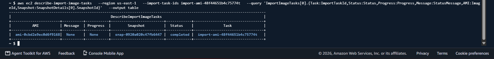
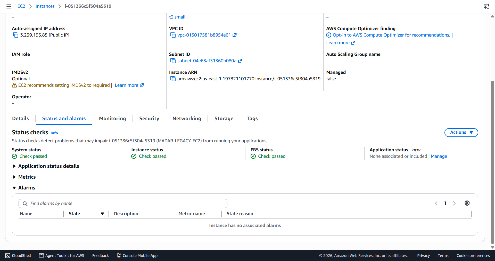
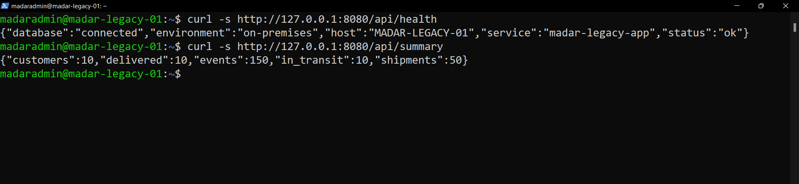
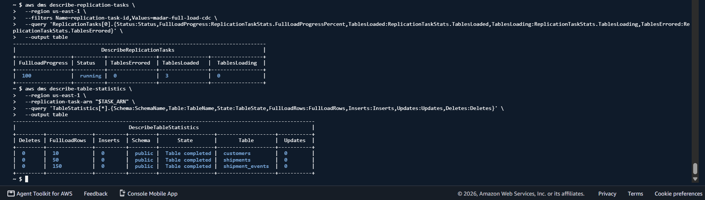
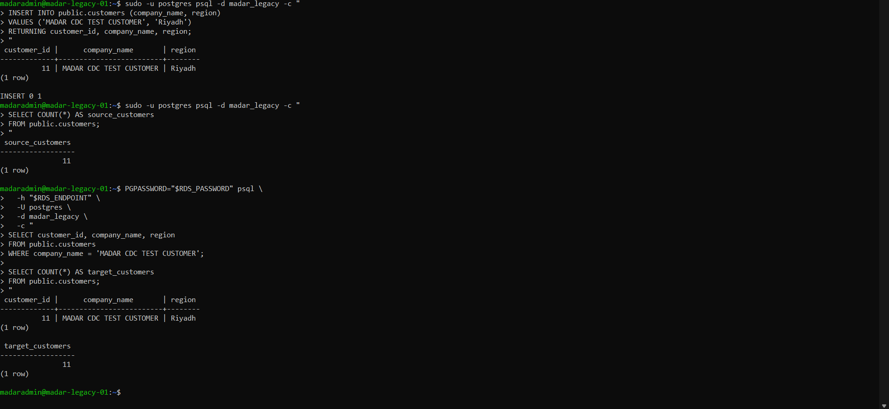
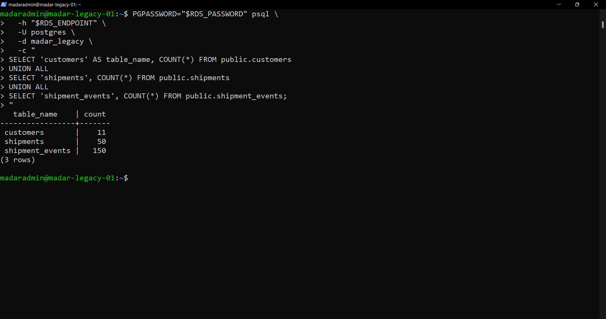
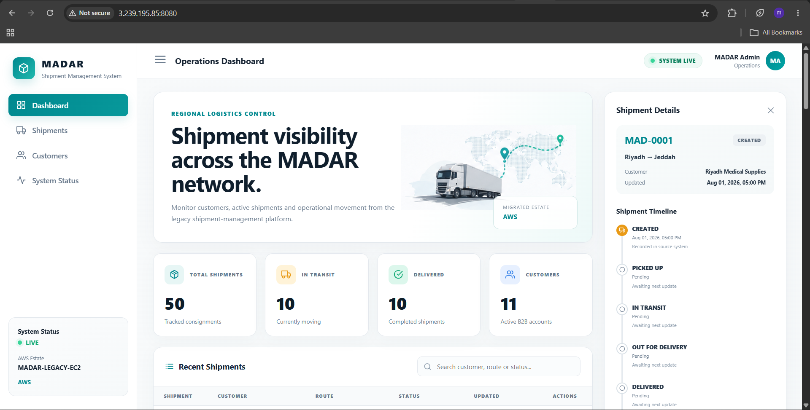
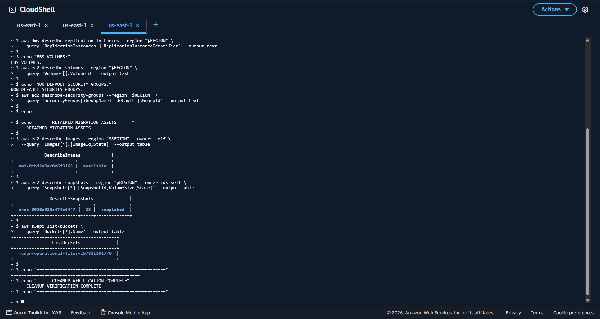

# MADAR — Legacy Migration & Data Center Exit

## Phase 03 of the MADAR Cloud Transformation

> **Status: COMPLETE — migration accepted, validated and cleaned up.**  
> VMware rehost → EC2 → PostgreSQL replatform to RDS → operational files to S3 → application cutover → dependency proof → cleanup.

MADAR is a hands-on, evidence-driven AWS migration case study built around a fictional logistics company and a real lab implementation. The project starts with a stateful VMware-hosted Ubuntu/PostgreSQL/Flask workload and closes only after workload validation, data reconciliation, CDC proof, file-integrity verification, application cutover and intentional cleanup.

> **MADAR is fictional.** The workload, Linux configuration, PostgreSQL data, AWS resources, commands, failures, troubleshooting decisions, screenshots and validation steps are authentic lab work.

---

## Executive outcome

```text
Source workload / recovery baseline                              PASS
AWS MGN experiment                               BLOCKED / ROOT-CAUSED
VMware -> EC2 with VM Import/Export                              PASS
EC2 PostgreSQL -> RDS with AWS DMS Full Load + CDC               PASS
Operational files -> Amazon S3                                   PASS
S3 object-count + SHA-256 round-trip validation                  PASS
Flask application -> RDS cutover                                 PASS
Local PostgreSQL disabled while application stayed healthy       PASS
Temporary migration infrastructure cleanup                       PASS
```

The project deliberately preserves failed paths. MGN and DMS endpoint failures are documented because production migration work is as much about isolating the failing layer as it is about reaching the happy path.

---

# 1 — Business problem

MADAR represents a company operating a shipment-management workload on a VMware-based legacy server. The objective was to exit the data-center-style environment without combining every risk into one big-bang rewrite.

The migration was decomposed by component:

```text
Legacy VMware VM
      |
      | REHOST
      v
Amazon EC2 landing workload
      |
      | DATABASE REPLATFORM
      v
Amazon RDS for PostgreSQL

Operational files
      |
      | FILE REPLATFORM
      v
Amazon S3
```

This staged model behaves like moving a company office one department at a time: first prove the server can survive the building move, then move the database, then move file storage, and only then switch the application dependency.

---

# 2 — Source workload

```text
MADAR-LEGACY-01
├── VMware virtual machine
├── Ubuntu Server 24.04.4 LTS
├── PostgreSQL 16.14
├── Flask application / TCP 8080
├── 25 GiB GPT + LVM/ext4 disk
├── scheduled operational reports
└── deterministic business baseline
    ├── customers = 10
    ├── shipments = 50
    └── shipment_events = 150
```


The deterministic dataset made validation measurable: `EC2 running` was never treated as proof that the business workload survived.

---

# 3 — Migration strategy and the MGN pivot

AWS Application Migration Service (MGN) was tested first. Source discovery and block replication reached `25/25 GiB`, `Healthy`, and `Ready for testing`.


The test conversion later failed. CloudTrail showed the failing resource was not the configured target `t3.small`; it was a service-managed MGN Conversion Server requesting `m5.large`, which the lab account plan did not allow.

```text
visible target instance      t3.small
service-managed conversion   m5.large
failing layer                conversion service
```

The project did not hide the failure or upgrade the account merely to make the demo pass. The strategy pivoted to EC2 VM Import/Export. See [`ADR-002`](decisions/ADR-002-mgn-free-plan-blocker-and-vm-import-fallback.md).

---

# 4 — VMware -> EC2 with VM Import/Export

The guest was prepared for AWS virtual hardware before export:

```text
ENA networking
NVMe block devices
GRUB / BIOS boot
LVM + ext4
eth0 + DHCP
SSH/PostgreSQL reboot readiness
```

The installer ISO was removed from the VMware export and the final VMDK was confirmed `streamOptimized`.

```text
VMware
  -> clean VMDK
  -> private S3 staging
  -> EC2 ImportImage
  -> EBS-backed AMI
  -> EC2
```

Final import artifacts:

```text
ImportTaskId  import-ami-48f44651b4c75774t
AMI           ami-0cbd2e9ec0d6f9168
Snapshot      snap-0920a020c47fb6447
Architecture  x86_64
Virtualization HVM
ENA           enabled
```



The imported instance then passed infrastructure and workload checks.



```text
Linux boot       PASS
eth0 / DHCP      PASS
NVMe + LVM       PASS
SSH              PASS
PostgreSQL       PASS
10 / 50 / 150    PASS
Flask API        PASS
```



---

# 5 — PostgreSQL -> Amazon RDS with AWS DMS

The EC2 database became the migration source. PostgreSQL was prepared for logical CDC:

```text
wal_level              logical
max_replication_slots  10
max_wal_senders        10
```

The target was private Amazon RDS PostgreSQL 16.14. DMS ran privately and database traffic used Security Group references on TCP/5432 rather than Internet-wide database ingress.

```text
EC2 PostgreSQL
      |
      | logical WAL
      v
AWS DMS
      |
      | Full Load + CDC
      v
Amazon RDS PostgreSQL
```

The target endpoint produced two useful failures before success:

```text
no encryption
   -> require SSL
password authentication failed
   -> synchronize credentials
successful
```

This demonstrated layered troubleshooting: routing and SGs were not weakened to solve an application-layer authentication problem.

---

# 6 — Full Load and CDC proof

Full Load result:

```text
Progress         100%
Tables loaded    3
Tables errored   0
customers        10
shipments        50
shipment_events  150
```



CDC was proven with a controlled source insert after Full Load. Customer #11 appeared on RDS without rerunning the initial load.



Final RDS reconciliation:

```text
customers         11
shipments         50
shipment_events   150
```



---

# 7 — Operational files -> Amazon S3

The operational file tree was synchronized to:

```text
s3://madar-operational-files-197821101770/operational-data/
```

The upload was not accepted merely because `aws s3 sync` completed.

```text
Source files       14
S3 objects         14
```

The S3 dataset was downloaded into an independent verification directory and every file was SHA-256 hashed again.

```text
ALL FILE HASHES MATCH
```

That round-trip check proves the bytes retrieved from S3 matched the source files.

---

# 8 — Application cutover to RDS

The Flask application originally used `localhost` PostgreSQL. Its database configuration was refactored to accept runtime environment values:

```text
MADAR_DB_HOST
MADAR_DB_NAME
MADAR_DB_USER
MADAR_DB_PASSWORD
MADAR_DB_SSLMODE
```

The application was then started against private RDS with SSL required.

Observed health:

```json
{"database":"connected","environment":"aws","host":"MADAR-LEGACY-EC2","service":"madar-legacy-app","status":"ok"}
```

Observed business summary:

```json
{"customers":11,"delivered":10,"events":150,"in_transit":10,"shipments":50}
```

### Before cutover


### After cutover



---

# 9 — Strongest cutover proof: kill the old dependency

A dashboard label is not migration proof. The decisive test was to stop local PostgreSQL after Flask was configured for RDS.

```text
local PostgreSQL    inactive
Flask /api/health   PASS
Flask /api/summary  PASS
business counts     11 / 50 / 150
```


Think of this like disconnecting the old warehouse after trucks have supposedly moved to the new one. If deliveries continue, the new route is real.

**Cutover decision: ACCEPT / CONTINUE.**

---

# 10 — Final cleanup

After acceptance evidence was captured, the temporary migration infrastructure was removed.

Deleted:

```text
DMS replication task
DMS source/target endpoints
DMS replication instance
DMS subnet group
RDS target
RDS subnet group
temporary migration Security Groups
temporary imported EC2 instance
orphaned 25 GiB EC2 volume
VM-import VMDK + staging bucket
temporary EC2 S3 instance profile/role/policy
```

Final audit showed no active Phase 03 lab:

```text
EC2 instances      none
standalone EBS     none
RDS instances      none
DMS instances      none
DMS tasks          none
DMS endpoints      none
NAT Gateways       none
Elastic IPs        none
Load Balancers     none
```



---

# 11 — Intentionally retained assets

Cleanup did not mean deleting recovery evidence blindly.

```text
AMI       ami-0cbd2e9ec0d6f9168
Snapshot  snap-0920a020c47fb6447
S3        madar-operational-files-197821101770
```

The AMI/snapshot preserve a reusable machine recovery artifact. The S3 bucket preserves the migrated operational dataset. They are intentionally retained storage assets; unlike EC2/RDS/DMS, they are not continuously running compute. Storage charges can still apply.

---

# 12 — Security controls demonstrated

```text
VM image staging       private S3 + Block Public Access
AWS service access     IAM roles instead of embedded AWS keys
Operator delegation    iam:PassRole verified
SSH                    restricted operator ingress during validation
PostgreSQL             no 0.0.0.0/0 database ingress
DMS/RDS                 SG-to-SG TCP/5432
RDS                    PubliclyAccessible=false
Target DB connection   SSL required
Secrets                not committed to Git
Recovery               pg_dump + retained AMI/snapshot during acceptance
Cleanup                temporary credentials/resources intentionally removed
```

---

# 13 — What this project demonstrates

```text
Discovery & dependency mapping
Recoverability before migration
AWS MGN experimentation
CloudTrail root-cause analysis
VMware guest portability preparation
EC2 VM Import/Export
IAM service delegation
Private S3 staging
EC2 workload acceptance
PostgreSQL logical replication
AWS DMS Full Load + CDC
Private Amazon RDS
Layered endpoint troubleshooting
Independent SQL reconciliation
Operational file migration to S3
SHA-256 integrity verification
Application database cutover
Dependency-removal testing
AWS cost-conscious cleanup
```

---

# 14 — Key engineering lessons

**1. The instance type you can see may not be the instance that failed.**  
MGN's visible target was `t3.small`; CloudTrail exposed the service-managed `m5.large` conversion request.

**2. `Running` is not workload acceptance.**  
The EC2 target was accepted only after OS, network, storage, database, data and application checks.

**3. Network reachability and authentication are different layers.**  
DMS reached RDS before TLS/credential corrections; the SG was not weakened to fix database-layer errors.

**4. CDC is not proven by a task saying `running`.**  
It was proven by customer #11 appearing automatically on RDS.

**5. `aws s3 sync` is not file-integrity proof.**  
The files were downloaded again and SHA-256 compared.

**6. A configuration change is not cutover proof.**  
Local PostgreSQL was stopped and the application still returned database-backed health and business data.

**7. Cleanup is part of migration engineering.**  
Temporary DMS/RDS/EC2/EBS/IAM/network resources were intentionally removed after acceptance.

---

# 15 — Evidence gallery

The complete evidence catalog is in [`evidence/README.md`](evidence/README.md). The final closeout sequence is curated in [`evidence/screenshots/README.md`](evidence/screenshots/README.md).

| Checkpoint | Evidence |
|---|---|
| Legacy application | [`madar-application-dashboard.png`](evidence/madar-application-dashboard.png) |
| MGN reached Ready for testing | [`mgn-ready-for-testing-healthy-replication.png`](evidence/mgn-ready-for-testing-healthy-replication.png) |
| VM Import completed | [`vm-import-completed-ami-created.png`](evidence/vm-import-completed-ami-created.png) |
| EC2 accepted | [`ec2-status-checks-passed.png`](evidence/ec2-status-checks-passed.png) |
| Flask accepted after rehost | [`migrated-application-api-validation-pass.png`](evidence/migrated-application-api-validation-pass.png) |
| DMS Full Load | [`dms-full-load-completed.png`](evidence/dms-full-load-completed.png) |
| CDC proof | [`cdc-replication-proof.png`](evidence/cdc-replication-proof.png) |
| Final RDS reconciliation | [`final-data-reconciliation.png`](evidence/final-data-reconciliation.png) |
| Before cutover | [`before-cutover-on-premises-dashboard.png`](evidence/before-cutover-on-premises-dashboard.png) |
| After cutover | [`after-cutover-aws-dashboard.png`](evidence/after-cutover-aws-dashboard.png) |
| Local DB disabled / RDS proof | [`local-postgres-disabled-rds-cutover-proof.png`](evidence/local-postgres-disabled-rds-cutover-proof.png) |
| Final cleanup audit | [`final-aws-cleanup-audit.png`](evidence/final-aws-cleanup-audit.png) |

---

# 16 — Repository structure

```text
.
├── README.md
├── CURRENT-STATE.md
├── REPOSITORY-SCOPE.md
├── checklists/
│   └── phase03-master-checklist.md
├── decisions/
│   └── architecture decision records
├── docs/
│   ├── discovery / strategy / architecture
│   ├── VM Import execution guide
│   ├── DMS/RDS execution guide
│   └── interview guide
├── evidence/
│   ├── README.md
│   ├── screenshots/
│   │   └── README.md        # curated final closeout path
│   └── migration evidence PNGs
├── legacy-lab/
│   ├── app/
│   └── scripts/
└── runbooks/
    ├── migration-day-runbook.md
    ├── cutover-rollback-template.md
    └── source-lab-operations.md
```

Terraform is intentionally absent because it was not used to provision the demonstrated migration path.

---

# 17 — Interview version

> I migrated a representative Ubuntu/PostgreSQL logistics workload from VMware to AWS and treated the project as a staged data-center exit rather than a simple EC2 launch. I first tested AWS MGN, reached healthy block replication, then root-caused a service-managed conversion-server account constraint through CloudTrail and pivoted to VM Import/Export. I prepared the guest for ENA/NVMe and EC2 boot compatibility, imported the VMDK into an AMI, and validated the full workload on EC2. I then replatformed PostgreSQL 16.14 to private RDS using DMS Full Load plus CDC, independently reconciled the data, and proved CDC with a controlled source change. I migrated 14 operational files to S3 and verified every file by round-trip SHA-256 comparison. Finally, I cut Flask over to RDS, stopped local PostgreSQL to prove the old dependency was gone, validated the application remained healthy, and cleaned the temporary DMS, RDS, EC2, EBS, IAM and staging resources while retaining only intentional recovery and data assets.

---

# 18 — Final project state

```text
VMware source baseline            DONE
MGN experiment / root cause       DONE
VM Import/Export rehost           DONE
EC2 workload acceptance           DONE
RDS Full Load                     DONE
DMS CDC proof                     DONE
Operational files -> S3           DONE
SHA-256 integrity verification    DONE
Application -> RDS cutover        DONE
Local DB dependency removal       DONE
Final AWS cleanup                 DONE
Evidence closeout                 DONE
```

## PHASE 03 — COMPLETE

**A resource existing is not proof that a migration succeeded.**

For MADAR, success required target behavior, reconciled data, a controlled change, file-integrity proof, removal of the old application dependency, and intentional cleanup.