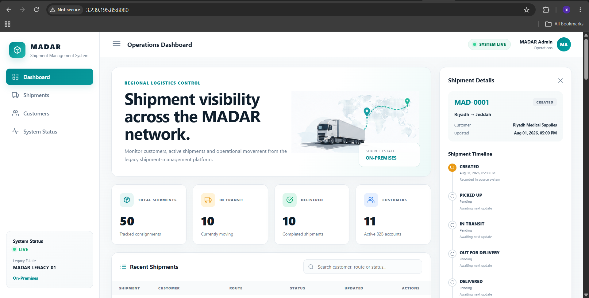

# Phase 03 Evidence Index

Evidence in this repository exists to prove engineering claims, not decorate the project. Phase 03 is now complete, including file migration, application cutover and final cleanup.

## Security rule

Evidence must not expose passwords, private keys, session tokens or reusable secrets. Errors are retained when they explain an engineering decision. VM images and database dumps remain outside Git.

---

## 1 — Source and discovery evidence

Representative artifacts include:

```text
madar-legacy-vm-system-baseline.png
madar-legacy-vm-network-ssh.png
madar-deterministic-dataset-baseline.png
madar-application-dashboard.png
madar-application-write-path-verified.png
madar-cron-background-job-verified.png
madar-pre-migration-db-backup-verified-v2.png
madar-pre-migration-files-backup-verified.png
```

These prove that a working stateful VMware workload existed before migration.


---

## 2 — MGN experiment

The MGN screenshots are retained because the first strategy genuinely progressed through source discovery and block replication before the managed conversion layer failed.


The root cause and decision to pivot are documented in `decisions/ADR-002-mgn-free-plan-blocker-and-vm-import-fallback.md`.

---

## 3 — VM Import/Export rehost

Key evidence:

```text
vmdk-in-s3.png
vmimport-role-permissions.png
vm-import-converting.png
vm-import-booting-62-percent.png
vm-import-completed-ami-created.png
imported-ami-available.png
ec2-imported-vm-running.png
ec2-status-checks-passed.png
ssh-success-migrated-ubuntu.png
post-migration-workload-validation.png
rehost-database-validation-pas.png
flask-running-on-migrated-ec2.png
migrated-application-api-validation-pass.png
```


---

## 4 — PostgreSQL / RDS / DMS

The database replatform evidence proves logical-CDC readiness, private RDS/DMS infrastructure, endpoint connectivity, Full Load, CDC and independent reconciliation.

```text
postgresql-cdc-ready.png
ds-postgresql-target-available.png
dms-replication-instance-available.png
source-endpoint-connection-success.png
target-endpoint-connection-success.png
dms-full-load-completed.png
cdc-replication-proof.png
final-data-reconciliation.png
```


Observed final database state:

```text
customers         11
shipments         50
shipment_events   150
```

---

## 5 — Final cutover & closeout screenshots

A dedicated curated index is available at [`screenshots/README.md`](screenshots/README.md).

### Before cutover


### Browser pre-cutover validation



### After cutover


### Strongest application cutover proof


This checkpoint proves the local PostgreSQL service was inactive while the database-backed Flask health and summary endpoints continued to return the accepted migrated data.

### Final AWS cleanup audit


This screenshot supports the closeout inventory showing that temporary migration compute/database/network resources were removed and only selected recovery/data assets were intentionally retained.

---

## 6 — Operational-file integrity

The file migration was validated with three independent checks:

```text
source file count       14
S3 object count         14
round-trip SHA-256      ALL FILE HASHES MATCH
```

The target prefix is:

```text
s3://madar-operational-files-197821101770/operational-data/
```

This closes the file-replatform acceptance criterion.

---

## 7 — Recommended reviewer path

A reviewer can understand the full project from this sequence:

```text
1  madar-application-dashboard.png
   -> real legacy workload exists

2  madar-deterministic-dataset-baseline.png
   -> deterministic source state

3  mgn-ready-for-testing-healthy-replication.png
   -> first migration strategy genuinely tested

4  vm-import-completed-ami-created.png
   -> fallback rehost completed

5  ec2-status-checks-passed.png
   -> imported VM healthy on EC2

6  migrated-application-api-validation-pass.png
   -> workload accepted after hypervisor move

7  dms-full-load-completed.png
   -> initial database migration complete

8  cdc-replication-proof.png
   -> ongoing logical change replicated

9  final-data-reconciliation.png
   -> RDS business state reconciled

10 before-cutover-on-premises-dashboard.png
   -> final legacy presentation before switch

11 after-cutover-aws-dashboard.png
   -> application running as migrated AWS estate

12 local-postgres-disabled-rds-cutover-proof.png
   -> local DB dependency removed; RDS cutover independently proven

13 final-aws-cleanup-audit.png
   -> temporary migration infrastructure cleaned
```

---

## Final evidence status

```text
Source baseline          COMPLETE
MGN experiment           COMPLETE
VM rehost                COMPLETE
RDS/DMS Full Load        COMPLETE
CDC proof                COMPLETE
File migration           COMPLETE
File integrity           COMPLETE
Application cutover      COMPLETE
Dependency-removal proof COMPLETE
Cleanup audit            COMPLETE
```

**Phase 03 evidence set: COMPLETE.**